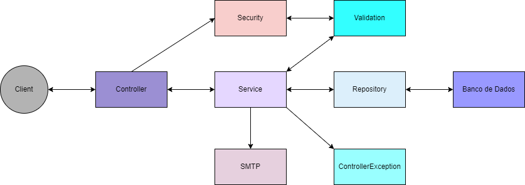
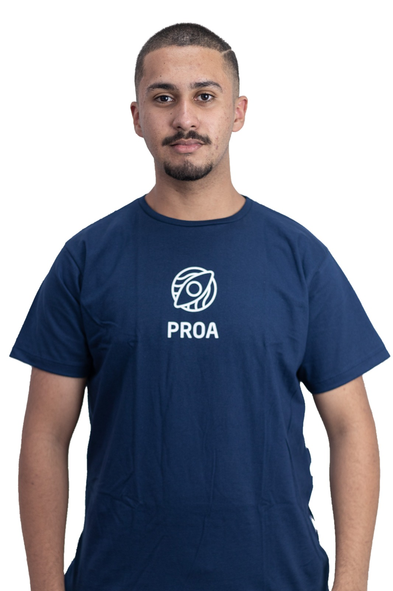

<h1 align=center>INCLUIDEV EMAIL API</h1>

<div align="center">
  
</div>

#
### DESCRICAO

#
### REPRESENTACAO DE FLUXO

<div align="center">
  
</div>

#
### MODELAGEM DE PERSISTENCIA

#
### MODELAGEM DE CLASSES

#
### EQUIPE

<table align="center">
  <tr>
    <td align="center">
      <a href="https://github.com/kaiquesouzasantos" title="Github Kaique">
        <br>
        <sub>
          <b>Kaique</b>
        </sub>
      </a>
    </td>
  </tr>
</table>

#
### TECNOLOGIAS

&nbsp;
&nbsp;
&nbsp;
&nbsp;
&nbsp;
&nbsp;

#
### CREDENCIAIS

- **User**: `owner`
- **Password**: `JLEdTDuhDrvCjpO7bMqYEZMJxlwHgd0yAED6vXbc9BL2kxv2xQ`

#
### REQUISICAO

#
### DOMINIO DA API

```
http://localhost:8080
```

#
### DOCUMENTACAO DA API

```
http://localhost:8080/swagger-ui/index.html
```
